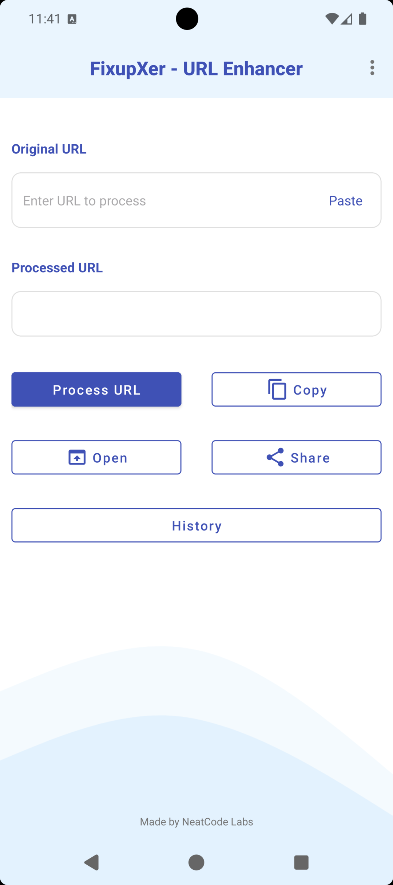
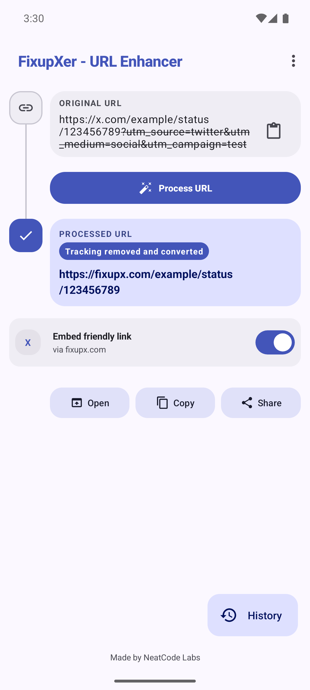
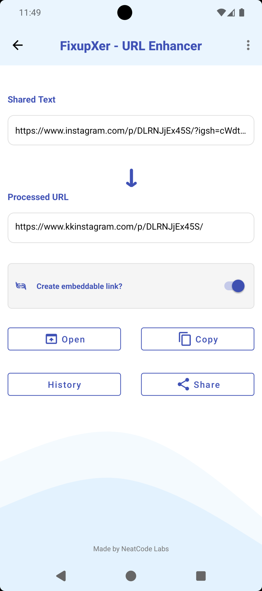
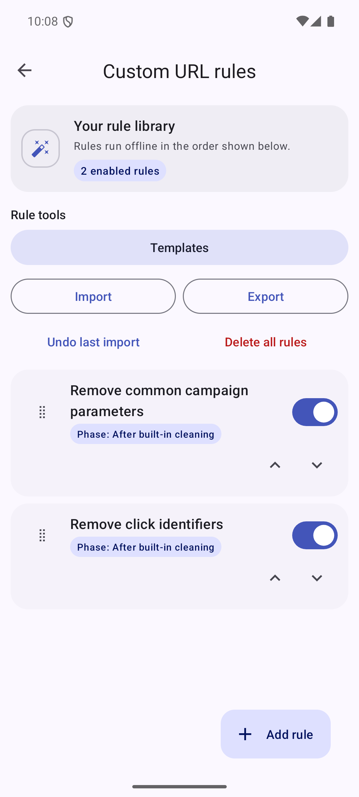
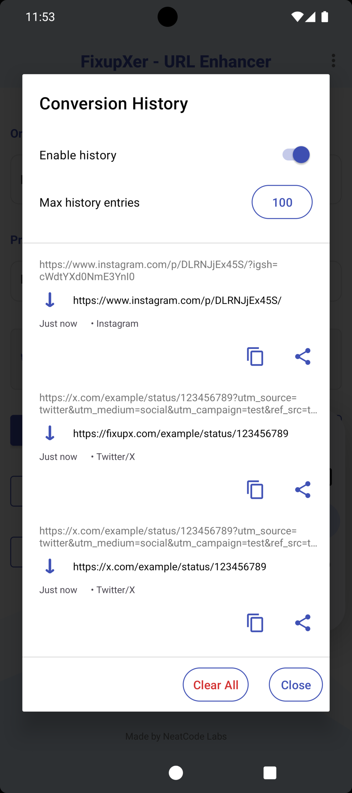
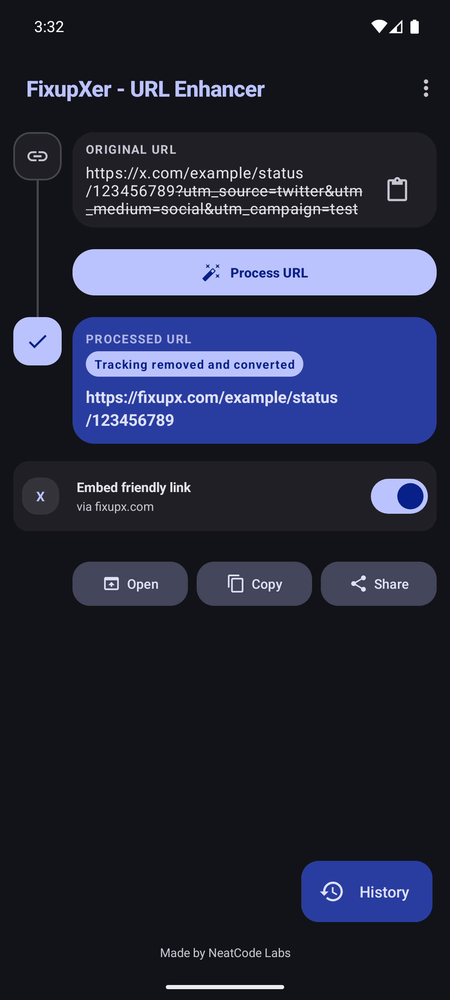

<h1 align="center">FixupXer</h1>

<p align="center">
  
</p>

<h3 align="center">Clean tracking from links. Improve social previews. Build your own offline URL rules.</h3>

<p align="center">
  <a href="https://github.com/NeatCode-Labs/fixupxer/releases/tag/v2.4.1"></a>
  <a href="https://developer.android.com/about/versions/lollipop"></a>
  <a href="LICENSE"></a>
  <a href="PRIVACY_POLICY.md"></a>
</p>

<p align="center">
  <a href="https://play.google.com/store/apps/details?id=com.fixupxer"></a>
  <a href="https://f-droid.org/packages/com.fixupxer/"></a>
  <a href="https://apt.izzysoft.de/packages/com.fixupxer"></a>
  <a href="https://github.com/NeatCode-Labs/fixupxer/releases/latest"></a>
</p>

<p align="center">
  <a href="docs/BROWSER_MODE_GUIDE.md">Browser Mode Guide</a> ·
  <a href="docs/CUSTOM_URL_RULES_GUIDE.md">Custom Rules Guide</a> ·
  <a href="docs/SUPPORTED_PLATFORMS.md">Supported Platforms</a> ·
  <a href="PRIVACY_POLICY.md">Privacy</a>
</p>

FixupXer is a free, open-source Android URL cleaner. It removes known tracking
parameters, optionally converts social links to embed-friendly domains, and lets
you build ordered custom processing rules. Processing runs locally: the app
declares no permissions and makes no network requests. When you choose an
Open/Share action, Android hands the resulting URL to the external app you
selected.

## Highlights

- **Selective tracking cleanup** — known tracking keys from 26 host-bound
  cleaners and one universal cleaner; unknown functional parameters are kept.
- **Private Link Guard** — warns when e-mails, tokens, or precise coordinates
  remain visible in a link — fully offline.
- **Custom URL rules** — create ordered scopes, actions, phases, excludes, and
  context-specific rules without editing raw JSON.
- **Teach by example** — infer a conservative disabled custom-rule draft from
  one original URL and its exact desired result.
- **Alternative frontends** — optional per-platform conversions to
  embed-friendly domains (Instagram, Facebook, Twitter/X, Bluesky posts,
  TikTok) or account-free reader frontends (Twitter/X, Bluesky, Reddit,
  Pinterest, plus experimental YouTube, Threads, and Instagram readers), with
  user-selectable built-in and custom domains.
- **Browser Mode** — clean eligible HTTP(S) links that Android routes through
  FixupXer before handing them to a browser, native app, share menu, or clipboard.
- **Process Text** — select a link in any app and choose “Clean link” to clean
  it in place, entirely offline.
- **Local history** — revisit, copy, share, or delete processed links; history
  is optional and remains on the device.
- **Manual backup** — export or restore settings, custom rules, and remembered
  after-clean destinations to a JSON file you choose (history never included).
- **Modern Android UI** — Material 3 before/after flow, light and dark themes,
  responsive layouts, handed action placement, and accessible controls.

## Screenshots

<table>
  <tr>
    <td align="center"><br><sub><b>Main screen</b></sub></td>
    <td align="center"><br><sub><b>Before and after</b></sub></td>
    <td align="center"><br><sub><b>Share flow</b></sub></td>
  </tr>
  <tr>
    <td align="center"><br><sub><b>Custom rules</b></sub></td>
    <td align="center"><br><sub><b>Conversion history</b></sub></td>
    <td align="center"><br><sub><b>Dark mode</b></sub></td>
  </tr>
</table>

## Quick start

### Share a link

1. Use **Share** on a link in any app.
2. Choose **FixupXer**.
3. Copy, share, or open the cleaned result.

### Paste a link

1. Open FixupXer and tap the paste icon.
2. Tap **Process URL**.
3. Review the before/after result and choose an action.

### Use Browser Mode

Enable **Browser mode** under **Settings > Configure Browser mode**, then
select FixupXer under Android **Default apps > Browser app**. FixupXer does
not render pages: it locally processes eligible HTTP(S) links Android sends
to it, then hands the result to your selected external action. Verified App
Links may bypass the default browser. Browser-only privacy Reader conversions
support X, Bluesky, Reddit, and Pinterest and are separate from Main/Share
embed targets. With **Ask what to do** you can save a per-host app choice
that is applied automatically on future links. Setup, action order,
conversions, and troubleshooting are in the
**[Browser Mode Guide](docs/BROWSER_MODE_GUIDE.md)**.

## Custom URL rules

Custom rules extend the built-in cleaners while preserving the app's offline
privacy model. They are **disabled by default** and run only after you enable
them in Settings.

- Scope rules to all URLs, an exact host, a domain with subdomains, a host
  group, or a safe RE2/J URL pattern.
- Remove all parameters, remove selected parameters, keep only selected
  parameters, replace matching text, extract redirect targets, or rewrite URL
  components from a template.
- Run rules before built-in cleaning, after cleaning, or after social-domain
  conversion; limit them to Main, Share, or Browser contexts.
- Preview unsaved changes in Test Lab, inspect a bounded execution trace, add
  excludes, stop after a match, and reorder rules.
- Save up to 20 isolated input → expected-output test vectors per rule. A rule
  can be enabled only after all of its saved vectors pass; imports with failures
  are retained as disabled drafts.
- Start from bundled templates or import/export validated, versioned JSON
  bundles through Android's system file picker. Imports are atomic and can be
  rolled back.

See the **[Custom URL Rules Guide](docs/CUSTOM_URL_RULES_GUIDE.md)** for
beginner-friendly examples and a complete action/scope reference.

## Built-in cleaning and link conversion

Dedicated cleaners cover Facebook, Instagram, Twitter/X, TikTok, LinkedIn,
Reddit, Amazon, YouTube, Substack, Google Search, Google Maps, Google Store,
Wikipedia, Threads, Twitch, Spotify, Pinterest, Snapchat, WhatsApp, Medium,
Bing, DuckDuckGo, eBay, Netflix, AliExpress, and Bilibili. A universal cleaner
removes proven common tracking parameters from other websites.

Curated offline redirect unwrapping handles Facebook `l.php`, LinkedIn
`/safety/go`, YouTube `/redirect`, Google Ads `pagead/aclk`, Reddit Mail,
Bluesky `go.bsky.app`, GeoRiot `target.georiot.com/Proxy.ashx`, and LinkSynergy
`click.linksynergy.com/link` wrappers. Destinations are decoded once and accepted
only when they are valid HTTP(S) URLs.

When a link from a supported platform is detected, the Main and Share screens
show a contextual conversion toggle with the active frontend and a **Change**
link. Every platform's picker is also always reachable from **Settings → Link
processing → Alternative frontends**. The picker separates **Embed frontends**
(better previews in chat apps) from **Privacy frontends** (read without an
account) and lets you add custom domains for any platform:

- Facebook links to a user-added custom frontend (no built-in domain is
  bundled; the former `facebookez.com` was retired after it began redirecting
  to an advertising network)
- Twitter/X links to `fixupx.com` (embed) or readers such as `xcancel.com`,
  `nitter.net`, community Nitter instances, and automatic instance pickers
- Bluesky post links to `fxbsky.app` (embed) or SkyLib readers
- Instagram and TikTok links to selectable built-in or custom proxies
- Reddit links to Redlib readers or `safereddit.com`
- Pinterest links to the `pinterest.bunk.im` reader
- YouTube, Threads, and Instagram reader conversions marked **Experimental**

These are local string transformations; FixupXer never contacts a frontend.
Reader conversions are off by default, and each platform remembers its own
selection with migration from known legacy proxies. Full domain rosters and
platform behavior are documented in
**[Supported Platforms](docs/SUPPORTED_PLATFORMS.md)**.

If you open a converted URL, the receiving browser, native app, or third-party
frontend performs the network request and applies its own privacy policy.

> Third-party conversion services are not operated by NeatCode Labs and may
> change or stop working. Conversion is optional and can be disabled per link.

## History

Conversion History is optional and stored only on the device.

- Tap an entry to load its cleaned URL.
- Use the visible copy, share, and delete actions on each entry.
- Clear all entries from the bottom action bar.
- Use the header settings icon to change the maximum retained entries
  (default: 100).
- Disable history at any time from the switch at the top of the sheet.

## Backup and restore

Open **Settings > Backup & restore** to save a versioned JSON file through
Android's system file picker. The file contains whitelisted preferences, custom
rules, and remembered Browser-mode destinations. Restoring validates the whole
file first, then replaces those backed-up items; it never imports URL history or
rule rollback snapshots.

## Privacy and safety

- **Zero app permissions** — no internet, storage, location, contacts, or
  notification permission.
- **No telemetry or analytics** — nothing is collected or transmitted.
- **No app-managed sync** — FixupXer never uploads preferences, history,
  custom proxies, rules, or rollback snapshots. Android may back up the
  preferences file according to your device/account settings; Room data
  (including URL history and custom rules) is excluded from automatic backup.
- **Explicit exports** — rule bundles and manual settings backups leave the app
  only when you choose a destination through Android's system file picker.
- **Explicit handoff** — FixupXer processes URLs offline; a browser, native app,
  share target, or privacy reader receives the result only after your selected
  action or Android Browser Mode routing.
- **Bounded processing** — input length, rule count, regex complexity, redirect
  hops, traces, and import sizes are limited.
- **Safe user regex** — custom patterns use linear-time RE2/J and never fall
  back to Java regular expressions.

Read the complete **[Privacy Policy](PRIVACY_POLICY.md)**.

## Installation

- **Google Play:** [install from the Play Store](https://play.google.com/store/apps/details?id=com.fixupxer)
- **F-Droid:** [install from F-Droid](https://f-droid.org/packages/com.fixupxer/)
- **IzzyOnDroid:** [open the IzzyOnDroid listing](https://apt.izzysoft.de/packages/com.fixupxer)
- **GitHub:** download the latest signed APK from
  **[GitHub Releases](https://github.com/NeatCode-Labs/fixupxer/releases/latest)**

GitHub APK installations may require temporarily allowing your browser or file
manager to install unknown apps.

## Frequently asked questions

<details>
<summary><b>Does FixupXer need internet access?</b></summary>

No. URL processing is fully offline and the app declares no network permission.
Documentation and report links are opened only when requested, in an external
browser.

</details>

<details>
<summary><b>What is the difference between cleaning and converting?</b></summary>

Cleaning removes tracking parameters. Conversion optionally changes a social
domain to an embed-friendly or account-free reader third-party domain. Either
feature can be used without the other.

</details>

<details>
<summary><b>Are Custom URL rules enabled automatically?</b></summary>

No. They remain off after installation or an update until you explicitly enable
them in Settings.

</details>

<details>
<summary><b>Can I disable or clear history?</b></summary>

Yes. Open History to disable collection, delete individual entries, or clear
everything. Rules and preferences are separate from History.

</details>

<details>
<summary><b>What happens if a conversion frontend stops working?</b></summary>

Open the **Change** link next to the conversion toggle and choose another
built-in frontend or add your own custom domain. Disable the toggle to keep
the original social-media domain.

</details>

## Technical details

<details>
<summary><b>Requirements, architecture, and test status</b></summary>

- Android 5.0 (API 21) or newer; target/compile SDK 35
- Kotlin 1.9.23, JDK 17, Views + View Binding, Material 3
- Hilt dependency injection and Room persistence
- Modular cleaner registry with O(1) domain dispatch
- Raw-preserving URL processing with immutable per-request rule snapshots
- RE2/J 1.8 for user-authored regular expressions
- 835 automated tests: 607 unit + 228 instrumentation
- Release lint, zero-permission manifest regression test, and REUSE 3.3
  compliance

</details>

<details>
<summary><b>Build from source</b></summary>

Prerequisites: JDK 17 and Android SDK 35.

```bash
git clone https://github.com/NeatCode-Labs/fixupxer.git
cd fixupxer
./gradlew assembleDebug
```

For a signed release build, copy `keystore.properties.template` to
`keystore.properties`, configure your own keystore, and run
`./gradlew assembleRelease`.

</details>

## License, attribution, and contributing

FixupXer is licensed under
**[GPL-3.0-or-later](LICENSE)**. Distributed builds and derivatives must follow
the license terms, including source-disclosure and same-license requirements.
All historical FixupXer versions and commits are retroactively licensed under
GPL-3.0-or-later, superseding earlier license notices. The software is provided
without warranty.

URL-cleaning research and independently re-implemented behaviour were informed
by [ClearURLs Rules](https://github.com/ClearURLs/Rules),
[Léon – The URL Cleaner](https://github.com/leon-cleaning-services/leon), and
[Untracker](https://github.com/zhanghai/Untracker).
Selected cleaner behaviours were independently re-implemented from Léon
(GPL-3.0-or-later) without copying code or rule data; the full audit is in
[docs/THIRD_PARTY_PROVENANCE.md](docs/THIRD_PARTY_PROVENANCE.md).
[RE2/J](https://github.com/google/re2j) 1.8 is used unmodified under its
upstream Go License; details are in `NOTICE` and
`LICENSES/LicenseRef-RE2J.txt`.

The alternative-frontend ecosystem used by built-in targets includes
[FxEmbed](https://github.com/FxEmbed/FxEmbed),
[InstaFix](https://github.com/Wikidepia/InstaFix),
[fxTikTok](https://github.com/okdargy/fxTikTok),
[Nitter](https://github.com/zedeus/nitter),
[SkyLib](https://codeberg.org/bg443/skylib-backend),
[Redlib](https://github.com/redlib-org/redlib),
[Invidious](https://github.com/iv-org/invidious), and
[Farside](https://github.com/benbusby/farside). FixupXer does not bundle their
code or operate these external services.

Community thanks:

- [@serrq](https://github.com/serrq) for proposing default-browser integration
  in [issue #1](https://github.com/NeatCode-Labs/fixupxer/issues/1).
- [@gituser765](https://github.com/gituser765) for documenting TikTok redirect
  short-link limitations in
  [issue #2](https://github.com/NeatCode-Labs/fixupxer/issues/2).
- [@Milliw](https://github.com/Milliw) for reporting the F-Droid Settings-menu
  regression in [issue #3](https://github.com/NeatCode-Labs/fixupxer/issues/3).
- [@IzzySoft](https://github.com/IzzySoft) for identifying F-Droid metadata
  limits in [issue #4](https://github.com/NeatCode-Labs/fixupxer/issues/4).
- [@gautamnabin5](https://github.com/gautamnabin5) for proposing TikTok
  conversion support in [PR #5](https://github.com/NeatCode-Labs/fixupxer/pull/5).
- [@ItsIgnacioPortal](https://github.com/ItsIgnacioPortal) for the detailed
  custom-rules proposal and testing feedback in
  [issue #6](https://github.com/NeatCode-Labs/fixupxer/issues/6).

Thanks also to the developers and operators of the built-in embed and privacy
frontend instances shown in the app.
The custom-rule engine and bundled templates were independently authored for
FixupXer; no third-party ruleset, parser, regex corpus, or proprietary code was
copied.

Third-party company and product names remain the property of their respective
holders; their appearance does not imply affiliation or endorsement.

Contributions are welcome — read **[CONTRIBUTING.md](CONTRIBUTING.md)** before
opening an issue or pull request.

## Support

If FixupXer is useful to you:

- Star the repository
- Report bugs through the app or
  **[GitHub Issues](https://github.com/NeatCode-Labs/fixupxer/issues)**
- Share the app with people who value privacy
- Optionally **[buy us a coffee](https://ko-fi.com/neatcodelabs)**

---

<p align="center">
  Created by <strong><a href="https://neatcodelabs.com">NeatCode Labs</a></strong><br>
  <em>Making the internet cleaner, one URL at a time.</em>
</p>

<p align="center">
  <a href="https://neatcodelabs.com"></a>
  <a href="https://ko-fi.com/neatcodelabs"></a>
</p>

