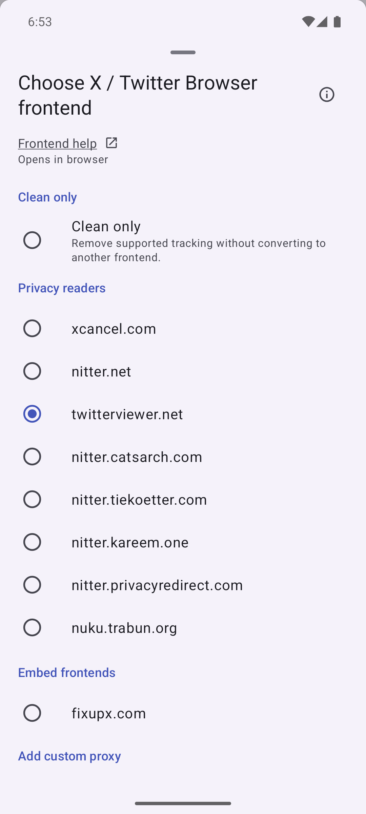
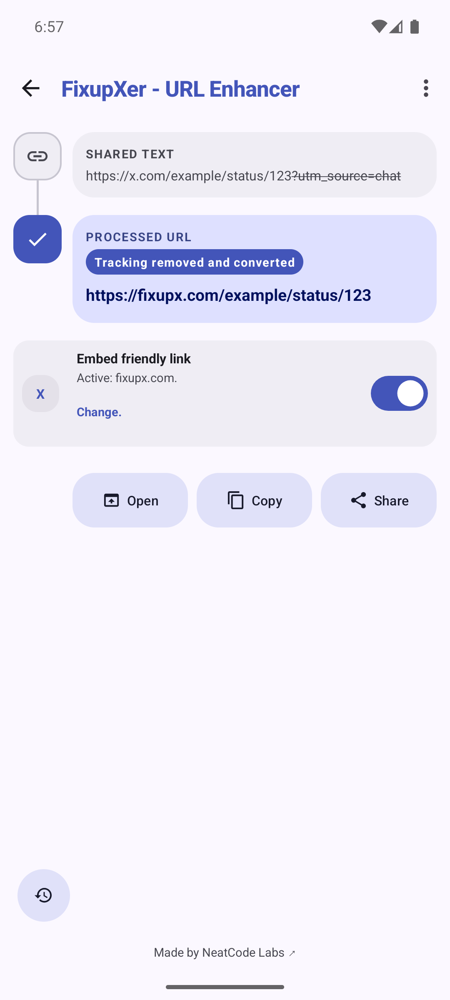
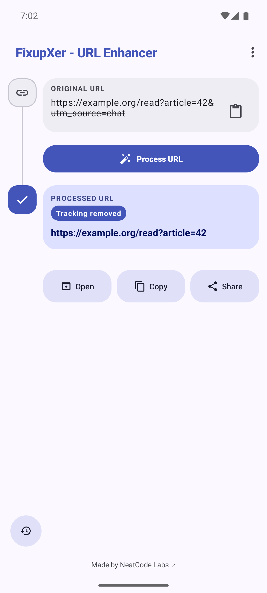
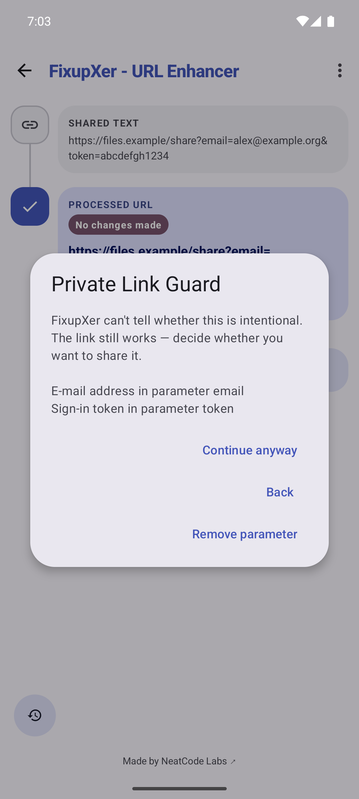
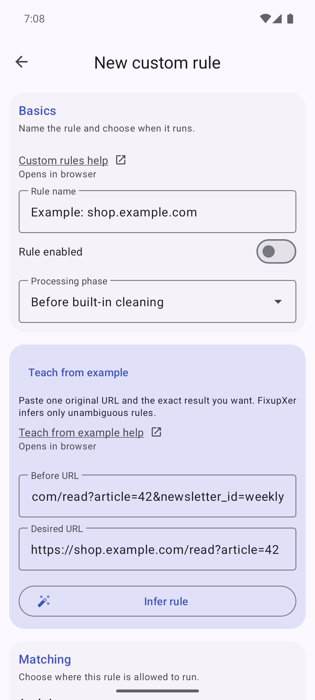
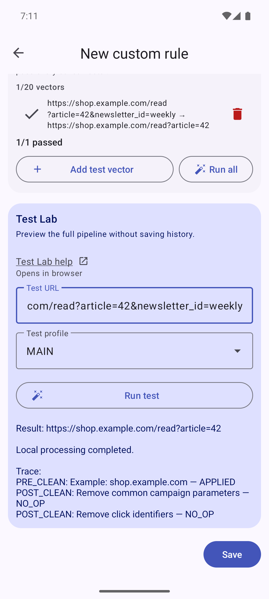

<h1 align="center">FixupXer</h1>

<p align="center">
  
</p>

<h3 align="center">Cleaner links. X readers without an account. Better previews in your chats.</h3>

<p align="center">
  <a href="https://github.com/NeatCode-Labs/fixupxer/releases/tag/v2.9.0"></a>
  <a href="https://developer.android.com/about/versions/lollipop"></a>
  <a href="LICENSE"></a>
  <a href="PRIVACY_POLICY.md"></a>
</p>

<p align="center">
  <a href="https://play.google.com/store/apps/details?id=com.fixupxer"></a>
  <a href="https://f-droid.org/packages/com.fixupxer/"></a>
  <a href="https://github.com/NeatCode-Labs/fixupxer/releases/latest"></a>
</p>

<p align="center">
  <a href="https://fixupxer.com">Website</a> ·
  <a href="docs/HELP.md">Help</a> ·
  <a href="docs/SUPPORTED_PLATFORMS.md">Supported Platforms</a> ·
  <a href="PRIVACY_POLICY.md">Privacy</a>
</p>

FixupXer is a free, open-source Android app for cleaning links and choosing where
they open. Paste a link, share it to FixupXer, or let Browser Mode process links
Android routes to it. Keep using your usual browser afterwards.

The app has **no ads, no account, and no Android permissions**. URL processing
runs entirely on your device. Opening a result hands it to another app or
website, which has its own network access and privacy policy.

## What you can do with it

- **Read public X posts without signing in to X.** Set the X Browser frontend
  to `twitterviewer.net`, for example, and X links routed through FixupXer open
  in that reader. Useful when an X sign-in prompt gets in the way of a public
  post or thread. Available content and complete threads depend on the reader;
  this does not unlock private posts. See [the setup example below](#read-x-links-in-a-reader).
- **Share a preview instead of a bare social link.** Convert X links to
  `fixupx.com`, or choose embed frontends for Instagram, TikTok, and other
  supported platforms. These services help chat apps display media previews.
  Your sharing choice is separate from your Browser choice: read an X link in
  TwitterViewer, but share it through FxEmbed. Preview support depends on the
  chat app and the external service.
- **Stop carrying tracking tags into the next chat.** Remove known tracking
  parameters before copying, sharing, or opening a link. For example,
  `example.org/read?article=42&utm_source=chat` becomes
  `example.org/read?article=42`: the article selector stays. Browser Mode can
  do this for links Android sends to FixupXer, then open your usual browser.
- **Notice an email address or sign-in token before passing it on.** Private
  Link Guard flags certain sensitive values still present in a URL. Review
  them, remove a parameter, or go back. It runs offline, but cannot detect
  every private value or tell whether one was included intentionally.
- **Teach it a cleanup the built-in rules do not know.** Supply a before URL
  and the result you want. For supported cases, such as removing a named query
  parameter, FixupXer drafts a rule for that site. Review and test it before
  enabling it. Test Lab shows the result without opening the website.
- **Choose where each site's links go.** Remember a preferred browser or save
  an app choice for an exact website host from **Ask what to do**. For example,
  use an installed compatible native app for one site and your browser for
  another, without repeating the same choice each time.

Also included: optional local history, manual settings and rule backups,
custom frontend domains, light and dark themes, and **Clean link** in text
selection menus where the source app supports Android's Process Text action.

## Screenshots

<table>
  <tr>
    <td align="center"><br><sub><b>Choose an X reader</b></sub></td>
    <td align="center"><br><sub><b>Prepare a link for chat</b></sub></td>
    <td align="center"><br><sub><b>See what changed</b></sub></td>
  </tr>
  <tr>
    <td align="center"><br><sub><b>Check before passing it on</b></sub></td>
    <td align="center"><br><sub><b>Teach from an example</b></sub></td>
    <td align="center"><br><sub><b>Try the rule locally</b></sub></td>
  </tr>
</table>

Captured from FixupXer v2.9.0 on an Android 15 emulator. URLs and sensitive
values shown in the cleaning examples are demonstration data.

## Quick start

### Share a link

1. Use **Share** on a link in any app.
2. Choose **FixupXer**.
3. Copy, share, or open the cleaned result.

### Paste a link

1. Open FixupXer and tap the paste icon.
2. Tap **Process URL**.
3. Review the before/after result and choose an action.

### Use Browser Mode

Enable **Browser mode** under **Settings > Configure Browser mode**, then
select FixupXer under Android **Default apps > Browser app**. FixupXer does
not render pages: it locally processes eligible HTTP(S) links Android sends
to it, then hands the result to your selected external action. Verified App
Links may bypass the default browser. **Configure Browser frontends** provides
separate reader, embed and custom choices for seven platforms, including
TikTok and Instagram. Add, edit or delete frontends in that picker; all changes
remain drafts until **Save**. YouTube and Threads use Clean only. Copy, Share and
Open in browser receive the final processed URL. Native actions restore known
X, Instagram and TikTok embed links to their original platform domain; privacy
readers and custom frontends stay in the browser. Set **Preferred browser** to remember
which browser should open browser-directed links, or keep **Always ask**.
With **Ask what to do** you can save a per-host app choice
that is applied automatically on future links. Setup, action order,
conversions, and troubleshooting are in the
**[Browser mode setup and troubleshooting](docs/HELP.md#browser-mode)**.

### Read X links in a reader

1. Open **Settings > Configure Browser mode > Configure Browser frontends**.
2. Choose **X / Twitter**, select **twitterviewer.net**, and tap **Save** in
   the Browser frontends dialog.
3. With Browser Mode configured, open an X link through FixupXer and choose
   **Open in browser**. The result opens on the selected reader.

The URL change happens locally: `x.com/<user>/status/<id>` becomes
`twitterviewer.net/<user>/status/<id>`. The reader then fetches the public
content. It may show ads or ask for cookie choices, and its availability and
thread support can change. FixupXer does not operate the reader or bypass
private-account restrictions.

To keep using `fixupx.com` for outgoing chat links, leave that selected in
**Settings > Link processing > Alternative frontends > X / Twitter**.
Main/Share and Browser selections are independent.

## Custom URL rules

Custom rules extend the built-in cleaners while preserving the app's offline
privacy model. They are **disabled by default** and run only after you enable
them in Settings.

- Scope rules to all URLs, an exact host, a domain with subdomains, a host
  group, or a safe RE2/J URL pattern.
- Remove all parameters, remove selected parameters, keep only selected
  parameters, replace matching text, extract redirect targets, or rewrite URL
  components from a template.
- Run rules before built-in cleaning, after cleaning, or after social-domain
  conversion; limit them to Main, Share, or Browser contexts.
- Preview unsaved changes in Test Lab, inspect a bounded execution trace, add
  excludes, stop after a match, and reorder rules.
- Save up to 20 isolated input → expected-output test vectors per rule. A rule
  can be enabled only after all of its saved vectors pass; imports with failures
  are retained as disabled drafts.
- Start from bundled templates or import/export validated, versioned JSON
  bundles through Android's system file picker. Imports are atomic and can be
  rolled back.

See the **[Custom URL rules Help](docs/HELP.md#custom-rules)** for
beginner-friendly examples and a complete action/scope reference.

## Built-in cleaning and link conversion

Dedicated cleaners cover Facebook, Instagram, Twitter/X, TikTok, LinkedIn,
Reddit, Amazon, YouTube, Substack, Google Search, Google Maps, Google Store,
Wikipedia, Threads, Twitch, Spotify, Pinterest, Snapchat, WhatsApp, Medium,
Bing, DuckDuckGo, eBay, Netflix, AliExpress, Bilibili, The Guardian, and
The New York Times. A universal cleaner removes proven common tracking
parameters from other websites.

Curated offline redirect unwrapping handles Facebook `l.php`, LinkedIn
`/safety/go`, YouTube `/redirect`, Google Ads `pagead/aclk`, Reddit Mail,
Bluesky `go.bsky.app`, GeoRiot `target.georiot.com/Proxy.ashx`, and LinkSynergy
`click.linksynergy.com/link` wrappers. Destinations are decoded once and accepted
only when they are valid HTTP(S) URLs.

When a link from a supported platform is detected, the Main and Share screens
show a contextual conversion toggle with the active frontend and a **Change**
link. Every platform's picker is also always reachable from **Settings → Link
processing → Alternative frontends**. The picker separates **Embed frontends**
(better previews in chat apps) from **Privacy frontends** (read without an
account) and lets you add custom domains for any platform:

- Facebook links to a user-added custom frontend (no built-in domain is
  bundled; the former `facebookez.com` was retired after it began redirecting
  to an advertising network)
- Twitter/X links to `fixupx.com` (embed) or readers such as `twitterviewer.net`, `xcancel.com`,
  `nitter.net`, community Nitter instances, and automatic instance pickers
- Bluesky post links to `fxbsky.app` (embed) or SkyLib readers
- Instagram and TikTok links to selectable built-in or custom proxies
- Reddit links to Redlib readers or `safereddit.com`
- Pinterest links to the `pinterest.bunk.im` reader
- YouTube, Threads, and Instagram reader conversions marked **Experimental**

These are local string transformations; FixupXer never contacts a frontend.
Reader conversions are off by default, and each platform remembers its own
selection with migration from known legacy proxies. Full domain rosters and
platform behavior are documented in
**[Supported Platforms](docs/SUPPORTED_PLATFORMS.md)**.

If you open a converted URL, the receiving browser, native app, or third-party
frontend performs the network request and applies its own privacy policy.

> Third-party conversion services are not operated by NeatCode Labs and may
> change or stop working. Conversion is optional and can be disabled per link.

## History

Conversion History is optional and stored only on the device.

- Tap an entry to load its cleaned URL.
- Use the visible copy, share, and delete actions on each entry.
- Clear all entries from the bottom action bar.
- Use the header settings icon to change the maximum retained entries
  (default: 100).
- Disable history at any time from the switch at the top of the sheet.

## Backup and restore

Open **Settings > Backup & restore** to save a versioned JSON file through
Android's system file picker. The file contains whitelisted preferences, custom
rules, and remembered Browser-mode destinations. Restoring validates the whole
file first, then replaces those backed-up items; it never imports URL history or
rule rollback snapshots.

Backup schema v2 includes all nine Browser frontend choices, separately from
Main/Share selections, and the preferred browser. Older files without a preferred
browser restore Always ask. Older v1 backups still import: their four reader choices
are migrated and all newly supported conversions start off. Import replaces the
entire Browser map, so existing v2 embed/custom choices cannot remain enabled
accidentally. Invalid files are rejected before settings change. Interrupted
restores retain a recovery journal and block Browser handoff until recovery succeeds.

See the [History and backup Help](docs/HELP.md#history-and-backup) for migration and recovery details.

## Privacy and safety

- **Zero app permissions** — no internet, storage, location, contacts, or
  notification permission.
- **No telemetry or analytics** — nothing is collected or transmitted.
- **No app-managed sync** — FixupXer never uploads preferences, history,
  custom proxies, rules, or rollback snapshots. Android may back up the
  preferences file according to your device/account settings; Room data
  (including URL history and custom rules) is excluded from automatic backup.
- **Explicit exports** — rule bundles and manual settings backups leave the app
  only when you choose a destination through Android's system file picker.
- **Explicit handoff** — FixupXer processes URLs offline; a browser, native app,
  share target, or privacy reader receives the result only after your selected
  action or Android Browser Mode routing.
- **Bounded processing** — input length, rule count, regex complexity, redirect
  hops, traces, and import sizes are limited.
- **Safe user regex** — custom patterns use linear-time RE2/J and never fall
  back to Java regular expressions.

Read the complete **[Privacy Policy](PRIVACY_POLICY.md)**.

## Installation

See [fixupxer.com/download](https://fixupxer.com/download) for all download options.

- **Google Play:** [install from the Play Store](https://play.google.com/store/apps/details?id=com.fixupxer)
- **F-Droid:** [install from F-Droid](https://f-droid.org/packages/com.fixupxer/)
- **GitHub:** download the latest signed APK from
  **[GitHub Releases](https://github.com/NeatCode-Labs/fixupxer/releases/latest)**

GitHub APK installations may require temporarily allowing your browser or file
manager to install unknown apps.

## Frequently asked questions

<details>
<summary><b>Does FixupXer need internet access?</b></summary>

No. URL processing is fully offline and the app declares no network permission.
Documentation and report links are opened only when requested, in an external
browser.

</details>

<details>
<summary><b>What is the difference between cleaning and converting?</b></summary>

Cleaning removes tracking parameters. Conversion optionally changes a social
domain to an embed-friendly or account-free reader third-party domain. Either
feature can be used without the other.

</details>

<details>
<summary><b>Are Custom URL rules enabled automatically?</b></summary>

No. They remain off after installation or an update until you explicitly enable
them in Settings.

</details>

<details>
<summary><b>Can I disable or clear history?</b></summary>

Yes. Open History to disable collection, delete individual entries, or clear
everything. Rules and preferences are separate from History.

</details>

<details>
<summary><b>What happens if a conversion frontend stops working?</b></summary>

Open the **Change** link next to the conversion toggle and choose another
built-in frontend or add your own custom domain. Disable the toggle to keep
the original social-media domain.

</details>

## Technical details

<details>
<summary><b>Requirements, architecture, and test status</b></summary>

- Android 5.0 (API 21) or newer; target/compile SDK 36
- Kotlin 1.9.23, JDK 17, Views + View Binding, Material 3
- Hilt dependency injection and Room persistence
- Modular cleaner registry with O(1) domain dispatch
- Raw-preserving URL processing with immutable per-request rule snapshots
- RE2/J 1.8 for user-authored regular expressions
- Release verification, test counts, signed-artifact checks and execution
  boundaries are recorded per version in the build and testing reports.
- Release lint, zero-permission manifest regression test, and REUSE
  compliance

</details>

<details>
<summary><b>Build from source</b></summary>

Prerequisites: JDK 17 and Android SDK 36.

```bash
git clone https://github.com/NeatCode-Labs/fixupxer.git
cd fixupxer
./gradlew assembleDebug
```

For a signed release build, copy `keystore.properties.template` to
`keystore.properties`, configure your own keystore, and run
`./gradlew assembleRelease`.

</details>

## License, attribution, and contributing

FixupXer is licensed under
**[GPL-3.0-or-later](LICENSE)**. Distributed builds and derivatives must follow
the license terms, including source-disclosure and same-license requirements.
All historical FixupXer versions and commits are retroactively licensed under
GPL-3.0-or-later, superseding earlier license notices. The software is provided
without warranty.

URL-cleaning research and independently re-implemented behaviour were informed
by [ClearURLs Rules](https://github.com/ClearURLs/Rules),
[Léon – The URL Cleaner](https://github.com/leon-cleaning-services/leon), and
[Untracker](https://github.com/zhanghai/Untracker).
Selected cleaner behaviours were independently re-implemented from Léon
(GPL-3.0-or-later) without copying code or rule data; the full audit is in
[docs/THIRD_PARTY_PROVENANCE.md](docs/THIRD_PARTY_PROVENANCE.md).
[RE2/J](https://github.com/google/re2j) 1.8 is used unmodified under its
upstream Go License; details are in `NOTICE` and
`LICENSES/LicenseRef-RE2J.txt`.

The alternative-frontend ecosystem used by built-in targets includes
[FxEmbed](https://github.com/FxEmbed/FxEmbed),
[InstaFix](https://github.com/Wikidepia/InstaFix),
[fxTikTok](https://github.com/okdargy/fxTikTok),
[Nitter](https://github.com/zedeus/nitter),
[SkyLib](https://codeberg.org/bg443/skylib-backend),
[Redlib](https://github.com/redlib-org/redlib),
[Invidious](https://github.com/iv-org/invidious), and
[Farside](https://github.com/benbusby/farside). FixupXer does not bundle their
code or operate these external services.

Community thanks:

- [@serrq](https://github.com/serrq) for proposing default-browser integration
  in [issue #1](https://github.com/NeatCode-Labs/fixupxer/issues/1).
- [@gituser765](https://github.com/gituser765) for documenting TikTok redirect
  short-link limitations in
  [issue #2](https://github.com/NeatCode-Labs/fixupxer/issues/2).
- [@Milliw](https://github.com/Milliw) for reporting the F-Droid Settings-menu
  regression in [issue #3](https://github.com/NeatCode-Labs/fixupxer/issues/3).
- [@IzzySoft](https://github.com/IzzySoft) for identifying F-Droid metadata
  limits in [issue #4](https://github.com/NeatCode-Labs/fixupxer/issues/4).
- [@gautamnabin5](https://github.com/gautamnabin5) for proposing TikTok
  conversion support in [PR #5](https://github.com/NeatCode-Labs/fixupxer/pull/5).
- [@ItsIgnacioPortal](https://github.com/ItsIgnacioPortal) for the detailed
  custom-rules proposal and testing feedback in
  [issue #6](https://github.com/NeatCode-Labs/fixupxer/issues/6).

Thanks also to the developers and operators of the built-in embed and privacy
frontend instances shown in the app.
The custom-rule engine and bundled templates were independently authored for
FixupXer; no third-party ruleset, parser, regex corpus, or proprietary code was
copied.

Third-party company and product names remain the property of their respective
holders; their appearance does not imply affiliation or endorsement.

Contributions are welcome — read **[CONTRIBUTING.md](CONTRIBUTING.md)** before
opening an issue or pull request.

## Support

If FixupXer is useful to you:

- Star the repository
- Report bugs through the app or
  **[GitHub Issues](https://github.com/NeatCode-Labs/fixupxer/issues)**
- Share the app with people who value privacy
- Optionally **[buy us a coffee](https://ko-fi.com/neatcodelabs)**

---

<p align="center">
  Created by <strong><a href="https://neatcodelabs.com">NeatCode Labs</a></strong><br>
  <em>Making the internet cleaner, one URL at a time.</em>
</p>

<p align="center">
  <a href="https://fixupxer.com"></a>
  <a href="https://ko-fi.com/neatcodelabs"></a>
</p>
